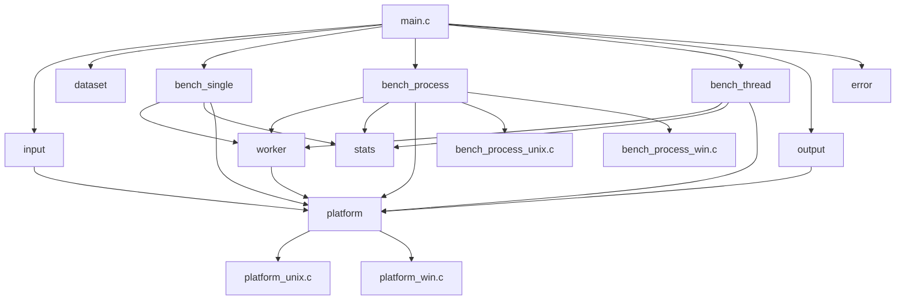

# concur-bench

A cross-platform concurrency benchmark tool that compares the performance of
single-threaded, multi-process, and multi-threaded computation on the same
workload: summing a large array of random integers.

Originally developed as a university project for the Operating Systems course
at the University of Parma, then refactored into a modular, cross-platform
benchmark with proper error handling, statistical analysis, and file output.

## Features

- Three benchmark modes: single-thread (baseline), multi-process, multi-thread
- Cross-platform: runs natively on Linux, macOS, and Windows
- Multiple iterations with statistical reporting (min, max, mean, stddev)
- Speedup analysis relative to the single-threaded baseline
- Correctness verification across all modes
- Output to terminal, text report, and CSV for external analysis
- Configurable: array size, worker count, seed, iteration count, verbose mode

## Architecture



**Platform abstraction layer**: All platform-specific code (timing, threads,
mutexes, pipes, process spawning, shared memory) is isolated behind a unified
API in `platform.h`. Unix and Windows implementations are compiled
conditionally by CMake.

**Process benchmark**: On Unix, child processes are created with `fork()` and
communicate results through pipes. On Windows, `CreateProcess()` is used with
shared memory (`CreateFileMapping`) since `fork()` is not available.

## Build

### Requirements

- CMake 3.10 or later
- A C11-compatible compiler:
  - GCC 4.9+ or Clang 3.5+ (Unix)
  - MSVC 2015+ (Windows)

### Unix (Linux / macOS)

```sh
make
```

Or manually:

```sh
mkdir build && cd build
cmake ..
cmake --build .
```

The executable is placed at `build/bin/concur-bench`.

### Windows

```powershell
mkdir build
cd build
cmake -G "Visual Studio 17 2022" ..
cmake --build . --config Release
```

The executable is placed at `build\bin\Release\concur-bench.exe`.

## Usage

Run the executable and follow the interactive prompts:

```
$ ./build/bin/concur-bench
concur-bench - Concurrency Benchmark Tool
==========================================

Verbose mode (detailed per-worker output) [y/n]: n
Array length (1000 - 2147483647): 1000000
Number of processes (1 - 256) [detected 8 cores]: 4
Number of threads (1 - 256) [detected 8 cores]: 4
Random seed (0 for auto, or 1 - 4294967295): 0
Benchmark iterations (1 - 100) [default 5]: 5
```

### Command-Line Options

```
--verbose            Enable detailed per-worker output
--iterations <N>     Set number of benchmark iterations (default: 5)
--help               Show usage information
```

## Output

### Terminal

```
=== concur-bench Results ===

System: Linux 6.1.0 x86_64, 8 logical cores
Run:    20260209_143022

Configuration:
  Array length:    1000000
  Processes:       4
  Threads:         4
  Seed:            314159
  Iterations:      5
  Verbose:         no

+-----------+---------+------------+------------+------------+------------+---------+
| Mode      | Workers | Min (s)    | Mean (s)   | Max (s)    | Stddev (s) | Speedup |
+-----------+---------+------------+------------+------------+------------+---------+
| single    |       1 |   0.003201 |   0.003421 |   0.003712 |   0.000201 |   1.00x |
| process   |       4 |   0.001102 |   0.001205 |   0.001350 |   0.000098 |   2.84x |
| thread    |       4 |   0.001023 |   0.001150 |   0.001298 |   0.000112 |   2.97x |
+-----------+---------+------------+------------+------------+------------+---------+

Correctness: PASS (all modes computed sum = 50498721)

Results saved to: results/run_20260209_143022/
```

### Files

Each run creates a timestamped directory under `results/`:

```
results/run_20260209_143022/
  report.txt    Detailed text report
  results.csv   Machine-readable CSV for analysis
```

## Project Structure

```
concur-bench/
  src/
    main.c                 Entry point and orchestration
    error.h / error.c      Error codes and reporting
    types.h                Shared type definitions
    platform.h             Cross-platform abstraction API
    platform_unix.c        POSIX implementation
    platform_win.c         Win32 implementation
    input.h / input.c      User input and argument parsing
    dataset.h / dataset.c  Random array generation
    worker.h / worker.c    Core computation logic
    bench_single.h / .c    Single-threaded benchmark
    bench_process.h        Multi-process benchmark interface
    bench_process_unix.c   Unix fork+pipe implementation
    bench_process_win.c    Windows CreateProcess+shm implementation
    bench_thread.h / .c    Multi-threaded benchmark
    stats.h / stats.c      Statistical computation
    output.h / output.c    Result formatting and file output
  results/                 Runtime output directory
  examples/                Example output files
  CMakeLists.txt           Cross-platform build configuration
  Makefile                 Unix convenience wrapper
```

## License

This project is licensed under the MIT License. See [LICENSE](LICENSE) for
details.

## Author

Claudio Bendini - University of Parma (2023)
